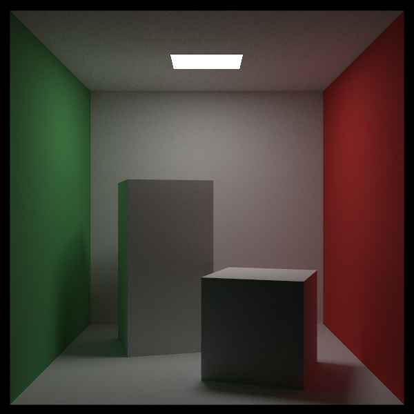
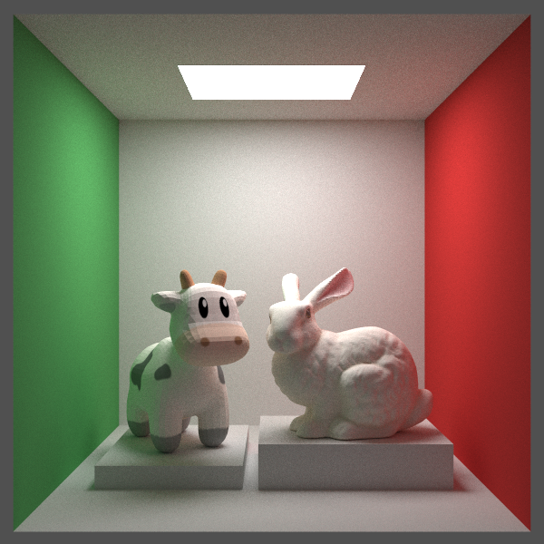

# README

A Renderer is based on ray tracing.

## How to use

### Run [CMakeLists.txt](CMakeLists.txt)

````shell
cmake -B build      # 生成构建目录
cmake --build build # 执行构建
````
### Qt

The UI is based on Qt 5. Before using [CMakeLists.txt](CMakeLists.txt), please change Qt's path here

```` cmake
#CMakeLists.txt
....
#Change Qt Path
set(CMAKE_PREFIX_PATH "D:/Qt/5.15.2/mingw81_64")
....
````
### Example

If you don't want to use Qt as the framework, just go to [example](./example) and run `run.bat`
in **WINDOWS OS**.

### OpenMP

The Render is accelerated by **OpenMP**. Make sure your compiler support it.

## Result

### Cornell Box

<div align="center">
    
    <div style="">
        Figure : Cornell Box
    </div>
</div>

### Bunny and Spot Cow

<div align="center">
    
    <div style="">
        Figure : Bunny and Spot
    </div>
</div>

## Supported Features

- [x] Object:  sphere, rectangle, triangle and triangle-mesh 
- [x] Operation:  translation and rotation.
- [x] Material: diffuse reflection, specular reflection, refraction, participating media and light source
- [x] Texture: solid color, noise texture and image texture mapping
- [x] Advanced Sampling: BRDF sampling, light sampling, NEE, multiple importance sampling
- [ ] Acceleration:
  - [x] BVH
  - [x] CPU Parallel: OpenMP
  - [ ] GPU Parallel: CUDA
- [ ] Cook-Torrance BRDF
- [ ] Ray-Marching in volume rendering
- [ ] Load scene in json format


## Reference

- [Ray tracing in one week](https://raytracing.github.io/)
- [PBRT3](https://pbr-book.org/3ed-2018/contents)
- [Scratchapixel 3.0](https://www.scratchapixel.com/index.html)